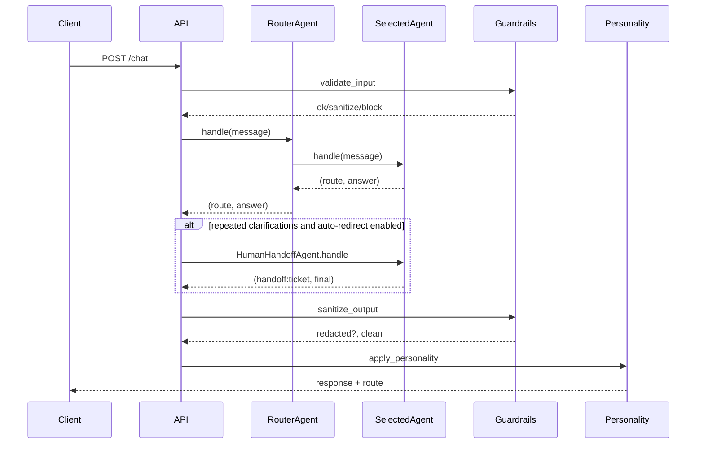

## Agent Swarm (FastAPI + RAG)

A multi-agent FastAPI application that routes user queries to specialized agents:
Knowledge (BM25 RAG over InfinitePay content), Customer Support (mock tools), Web Search, Slack Notifications, and Human Handoff. Guardrails validate input/output and a personality layer adapts tone.

### Table of contents
- Installation (local)
- Running (local and Docker)
- Configuration (env vars)
- API Endpoints
- cURL Examples
- RAG Index (optional)
- Testing & QA
- Project Structure
- Troubleshooting

### Installation (local)
```bash
# Python 3.11 recommended
python -m venv .venv
source .venv/bin/activate
pip install -r requirements.txt
cp .env.example .env  # then edit as needed
```

### Running
- Dev (auto-reload):
```bash
uvicorn app.main:app --reload
```
- UI (Streamlit, run in a second terminal):
```bash
streamlit run ui/streamlit_app.py
```
- Docker:
```bash
docker build -t agent-swarm .
docker run -p 8000:8000 --env-file .env agent-swarm
```

Open the API docs at `http://localhost:8000/docs`.
Open the UI at `http://localhost:8501`.

### Configuration
Set variables in `.env` (see `.env.example`):
- `DATA_DIR`: base data dir (default `./data`)
- `RAG_USE_WEB`: 1/0 to enable live web page ingestion fallback
- `USE_LLM`: 1/0 to enable the LLMAgent path
- `OPENAI_API_KEY`: required if `USE_LLM=1`
- `LLM_MODEL`, `LLM_MAX_TOKENS`, `LLM_TEMPERATURE`: LLM tuning
- `SLACK_WEBHOOK_URL`: optional Slack notifications
- `AUTO_REDIRECT_ON_FALLBACK`: 1/0 to auto-redirect to human after repeated clarifications
- `REDIRECT_MAX_CLARIFICATIONS`: number of clarification replies before redirect (default 2)

### API Endpoints
- POST `/chat`
  - body: `{ "message": string, "user_id": string }`
  - returns: `{ response: string, route: string }`
- GET `/support/user_info/{user_id}`
- GET `/support/transfer_status/{user_id}`
- POST `/test/force_transfer/{user_id}` (test-only)
  - body: `{ "status": "queued|processing|completed|failed", "amount"?: number }`
- POST `/test/force_redirect/{user_id}` (test-only)
  - effect: immediately creates a handoff ticket for the user

### cURL Examples
- Chat:
```bash
curl -s -X POST http://localhost:8000/chat \
  -H 'Content-Type: application/json' \
  -d '{"message":"What are the fees of the Maquininha Smart","user_id":"client789"}'
```
- Force a queued transfer (QA):
```bash
curl -s -X POST http://localhost:8000/test/force_transfer/client789 \
  -H 'Content-Type: application/json' \
  -d '{"status":"queued","amount":250.50}'
```
- Check transfer status (direct tool endpoint):
```bash
curl -s http://localhost:8000/support/transfer_status/client789
```

### RAG Index (optional, advanced)
The KnowledgeAgent uses a lightweight BM25 index over snapshots in `data/knowledge`. A FAISS-based semantic index can also be built to experiment with vector retrieval.

Build FAISS index:
```bash
python -m rag.build_index \
  --source_dir $(pwd)/data/knowledge \
  --persist_dir $(pwd)/data/index/faiss \
  --model_name sentence-transformers/paraphrase-multilingual-MiniLM-L12-v2 \
  --device cpu --chunk_size 1000 --chunk_overlap 150
```

### Testing & QA
- Lint (basic):
```bash
python -m pyflakes app || true  # example static check
```
- Run tests (requires pytest):
```bash
pytest -q
```
- Manual QA script (examples):
```bash
# Fees
curl -s -X POST http://localhost:8000/chat -H 'Content-Type: application/json' \
  -d '{"message":"What are the fees of the Maquininha Smart","user_id":"qa123"}'
# Sign-in support
curl -s -X POST http://localhost:8000/chat -H 'Content-Type: application/json' \
  -d '{"message":"I cannot sign in","user_id":"qa123"}'
# Force queued transfer
curl -s -X POST http://localhost:8000/test/force_transfer/qa123 -H 'Content-Type: application/json' \
  -d '{"status":"queued","amount":199.90}'
curl -s -X POST http://localhost:8000/chat -H 'Content-Type: application/json' \
  -d '{"message":"Why I am not able to make transfers?","user_id":"qa123"}'
```

### Project Structure
- `app/main.py`: FastAPI app, routes, guardrails wiring
- `app/router.py`: RouterAgent - intent routing
- `app/agents/knowledge.py`: BM25 KnowledgeAgent and summarizers
- `app/agents/support.py`: CustomerSupportAgent and mock tools
- `app/agents/handoff.py`: Human handoff (ticketing)
- `app/agents/slack.py`: Slack notifications
- `app/guardrails.py`: input/output validation
- `app/personality.py`: tone adapter
- `data/knowledge/*.txt`: knowledge snapshots
- `rag/*`: optional FAISS build/query utilities
- `tests/*`: unit and e2e examples

### Message workflow


### Troubleshooting
- Server not starting: ensure Python 3.11, `pip install -r requirements.txt` succeeded.
- `/chat` 500 error: check console logs; verify `.env` and network.
- No LLM replies: set `USE_LLM=1` and `OPENAI_API_KEY`.
- No results for knowledge: verify `data/knowledge` exists; set `RAG_USE_WEB=1` to allow live fallback.

---

### Notes
- Guardrails: blocks unsafe intents and masks profanity; redacts PII from outputs.
- Personality: adds a friendly prefix/suffix to answers.
- This repository favors deterministic behavior and offline snapshots for stable evaluation.
